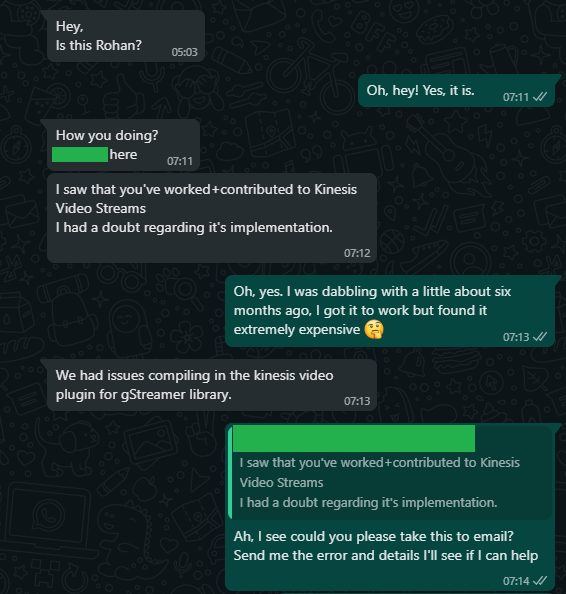

# The story of how I (kinda') fixed AWS Kinesis Producers, helped a student and saved humanity hundreds of  man hours! 

After investing about 20 hours, I finally managed to get AWS Kinesis Video Streaming Producers to work on my Raspberry Pi, despite of the confusing instructions, Github repos which were widely different from the official docs & too many alternative ways to run things - this is the story of how I did that. 

## 👦🏽 How did it start?

It all started with an innocent looking WhatsApp message, from a student who was trying to get AWS Kinesis Video Streams to work for a college project. He said he saw my commits to the AWS Kinesis repo and messaged me asking for help to get it up and running. 

I arrogantly thought, "Ah, newbies can't even follow the docs properly."  Back then, little did I know how deep this rabbit hole went, what followed were 3 entire days of research, googling and total mind-funkery, all just to get a simple "send data to cloud script" working.

## 🖤 You stare into the abyss...

What we wanted to achieve was pretty simple, we just wanted a way to stream video frames to AWS Kinesis from `/dev/video0` on Linux. Instinctively I looked up the AWS docs and here is where the trouble started

The Problems.

### GStreamer?!

Turns out there are mainly 2 ways to get the AWS Kinesis Producer libraries to working. One is using the compiled C++ code from a Github repo and other is by compiling a GStreamer plugin, but that's not all. The GStreamer command changes slightly depending on what platform you are on, this means there are in all 2 x 3 (Mac/Win/Linux) ways to get this up and running that you are greeted with right when you first load up their hello-world example. One could patiently try to read through all of this but the docs even lack a *Prerequisites Section*, this makes getting started even more difficult. 

Suggested Fixes - *Adding a Prerequisites Section will easily fix this.*

### Docker to the rescue?...No

The next way to get the Kinesis Video Producer up and running is by using Docker, one would imagine that this would be lesser of the two evils and it would work similarly across all platforms but you would still be wrong. The docs briefly mention that there is some kind of Docker way to run the Producer but towards the end they leave you off with  - **Start streaming from the camera using the `gst-launch-1.0` command that is appropriate for your device.**

The commands GStreamer commands they wanted me to run here kept on complaining that the GStreamer Plugin to support Kinesis-stuff was not installed.

This essentially meant even Amazon's own Docker Images are not working.

Suggested Fixes - *Installing things using Docker is a separate way to get the producer up, it should have come with **complete** instructions on what we are supposed to do, one should not have to run back and forth between several pages.*

### Inequality among platforms

Now, on Windows and Mac you cannot get the web camera streaming working with Docker, but on Linux you can. There is no table which tells you which way allows you to do what, what are the advantages and what are the disadvantages of that way and so on. This makes it all really a hit-and-miss approach while deciding what to do. 

Suggested Fixes -  *All the 2 different ways (Docker and GStreamer) and ways for different platforms are all sprinkled in with each other a better way would be to create a separate and complete tutorial for each platform, and then add a comparison sheet to summarize everything nicely.*

This was just the start, these were all of the glaring issues I could see right off the bat when I took a look at AWS's documentation, Azure on the other hand in one of their Azure IOT tutorials runs us through each scenario completely from start to finish. They also have several videos to show us how to get things up.

## 🌪 Smoke & Mirrors

Back to the problem we were trying to solve - "how to get a AWS Kinesis Producer running on Linux"

Initially I just assumed that the docs were difficult to understand but correct, I just needed to follow them precisely. But, boy! was I wrong. I soon came to the realization that the docs were flat out lying. Yes, let me explain.

In [Using the C++ Producer SDK on Raspberry Pi](https://docs.aws.amazon.com/kinesisvideostreams/latest/dg/producersdk-cpp-rpi.html)  the docs tell you to run **install-script**, but I have look around and if one were to follow the docs to the point, and I have you won't be able to find any such file. The closest thing you can find to something like this in a previous version of the GitHub repo in one of the older commits.

* but the docs are flat out lying

## 🔥  Solution

* did I get it working
* Amazon reach out to me, I'll build images for the RTSP stuff too.
* this may not be the fastest way, but give them something to start with they can make it better later.

## 👩🏽‍🚀  Conclusion

### AWS Kinesis is great

Personally, I think this enormous level of complexity to get things up and running with AWS Kinesis makes the entire pipeline look very difficult to use and because I have used AWS Kinesis before I know for a fact that this is not the case, AWS Kinesis is pretty cool and paired up with SageMaker it is capable of doing really impressive things. (expensive, yes but impressive things)

### The Space-Time Continuum

I am also confident that Rohan from 1 year ago would have certainly given up on trying to get this working, and because all the ways to get an AWS Kinesis Producer up and running are considerably difficult Amazon is actually losing out on a large chunk of new users which would have otherwise used the service but now fail to do so. 

It is also really surprising to note that the ways I tried to get the Producer up and running are also the ways most web developers would try to get things running and all of those failed, I had to literally go back in time to get the Producer working. When customers have to bend the space-time continuum to get your service working it is rarely a good thing.

### Currently no way to get it up

The issue disproportionately ended up affecting all of the new users who were trying to use AWS Kinesis, virtually without being very very smart, and without using Github commit history I cannot think of a way someone would be able to get the Producer running, this means there will be very few people are able to get it up.

